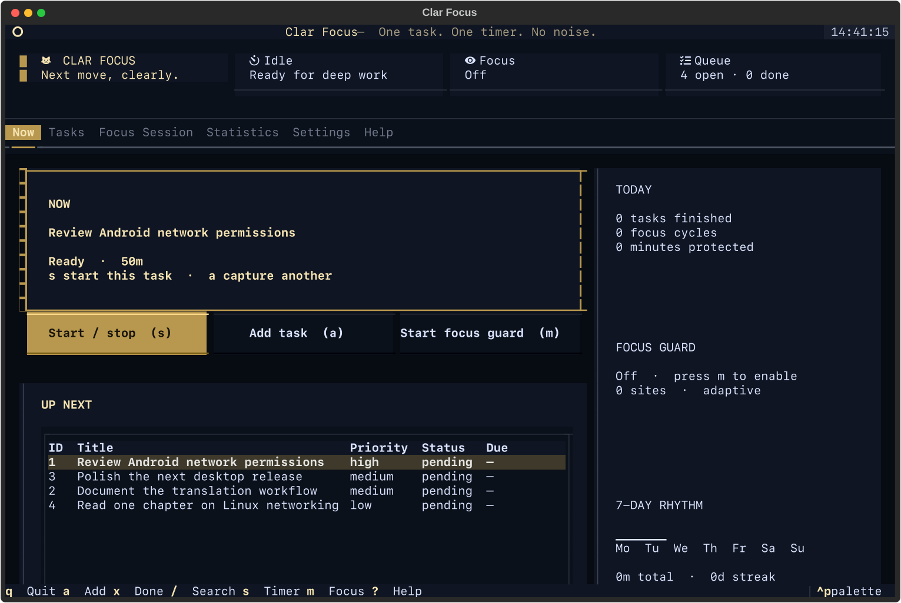

# Clar Focus

[English](#english) · [Türkçe](#türkçe)



## English

Tasks, Pomodoro sessions and reversible website blocking in one terminal application for Arch Linux, Hyprland and Omarchy.

### Features

- SQLite task manager with priorities, tags, due dates, estimates and search.
- Configurable work/break sessions, session history and productivity statistics.
- Focus blocking through managed `/etc/hosts` markers, with recovery commands.
- Native Omarchy bar status and a CLI alongside the Textual interface.

### Getting started

Python 3.12+ is required. The installer creates a dedicated environment in `~/.local/share/clar-focus/venv`, links commands into `~/.local/bin`, and installs bar integration when the Omarchy configuration is present.

```bash
git clone https://github.com/talhacaglar/Clar-Focus.git
cd Clar-Focus
./install.sh
clar-focus
```

Focus-mode hosts changes use a privileged helper; ordinary task management does not require root. See the technical reference for strict mode, recovery, CLI commands, keyboard controls and tests.

The screenshot uses an isolated demonstration database; it does not show personal tasks.

[Detailed technical reference](REFERENCE.md)

## Türkçe

Arch Linux, Hyprland ve Omarchy için görevleri, Pomodoro oturumlarını ve geri alınabilir site engellemeyi tek terminal uygulamasında birleştirir.

### Özellikler

- Öncelik, etiket, son tarih, süre tahmini ve arama destekli SQLite görev yöneticisi.
- Ayarlanabilir çalışma/mola oturumları, oturum geçmişi ve verimlilik istatistikleri.
- Yönetilen `/etc/hosts` işaretleriyle odak engelleme ve kurtarma komutları.
- Textual arayüzün yanında CLI ve yerel Omarchy bar durum göstergesi.

### Başlangıç

Python 3.12+ gerekir. Kurucu `~/.local/share/clar-focus/venv` altında ayrı ortam oluşturur, komutları `~/.local/bin` içine bağlar ve Omarchy yapılandırması varsa bar entegrasyonunu kurar.

```bash
git clone https://github.com/talhacaglar/Clar-Focus.git
cd Clar-Focus
./install.sh
clar-focus
```

Odak modunun hosts değişiklikleri yetkili yardımcı üzerinden yapılır; normal görev yönetimi root gerektirmez. Katı mod, kurtarma, CLI komutları, klavye kontrolleri ve testler teknik referanstadır.

Ekran görüntüsü ayrı bir örnek veritabanıyla hazırlanmıştır; kişisel görevleri içermez.

[Ayrıntılı teknik referans](REFERENCE.md)
